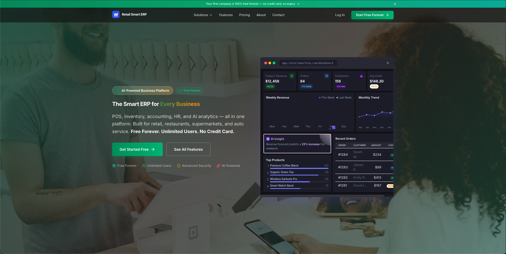
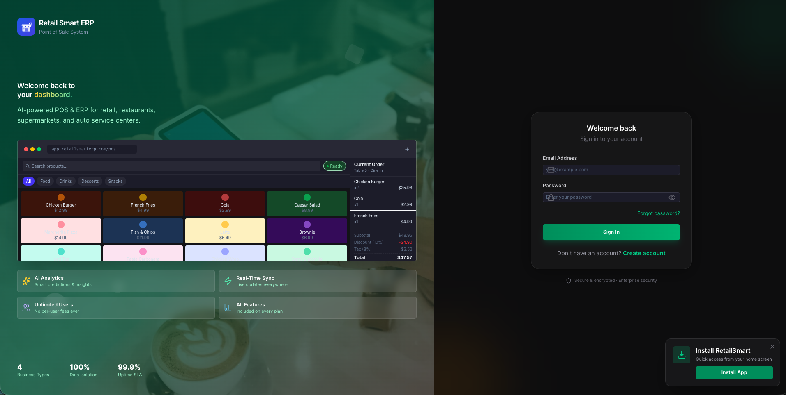
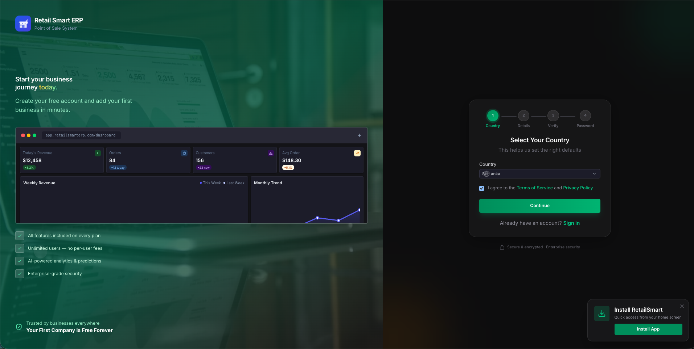
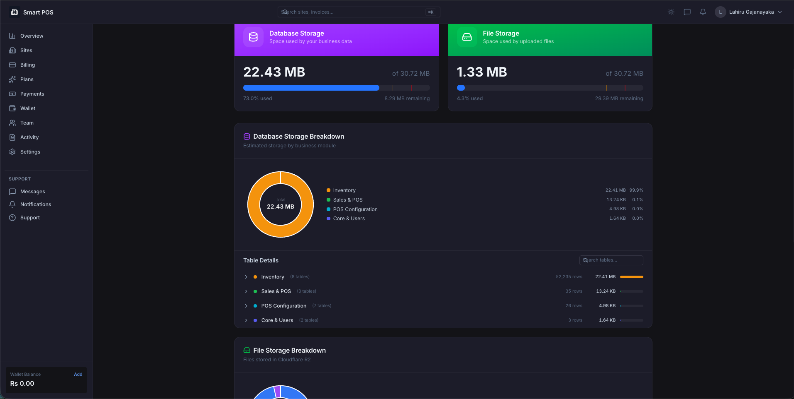
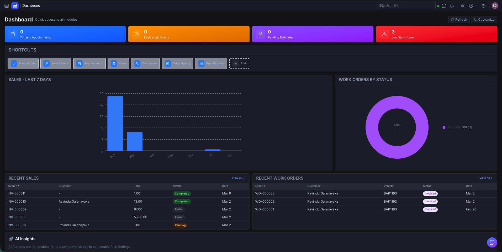
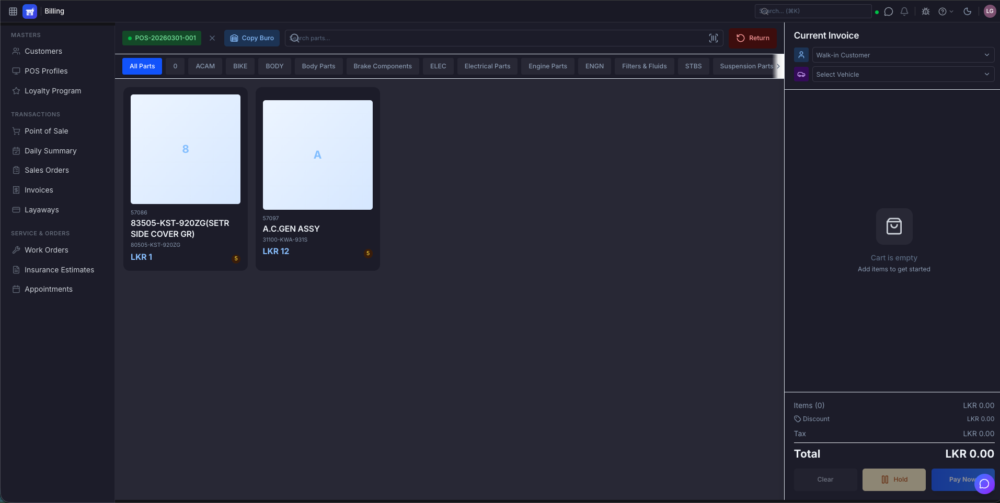
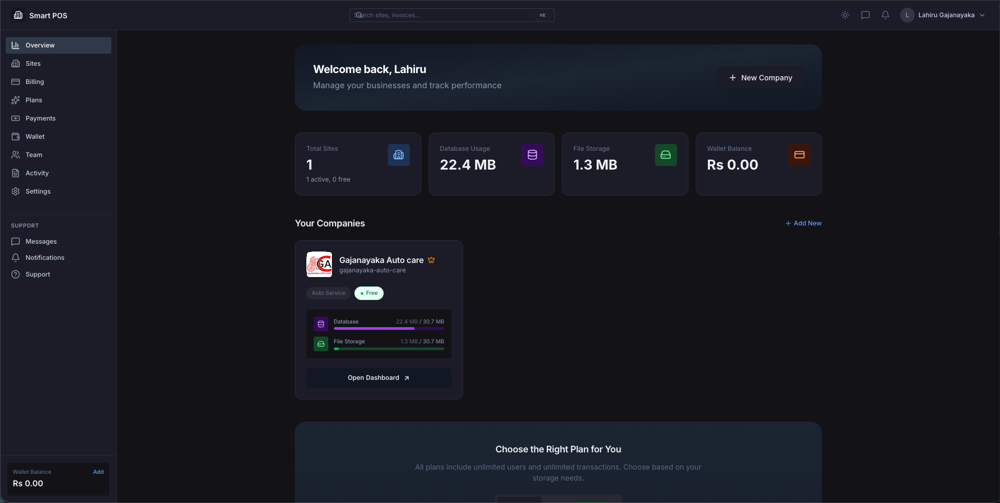
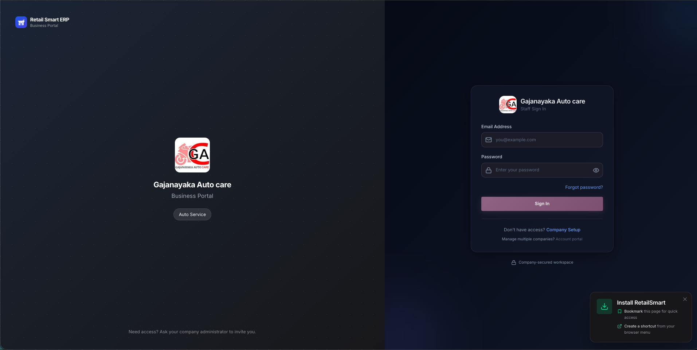
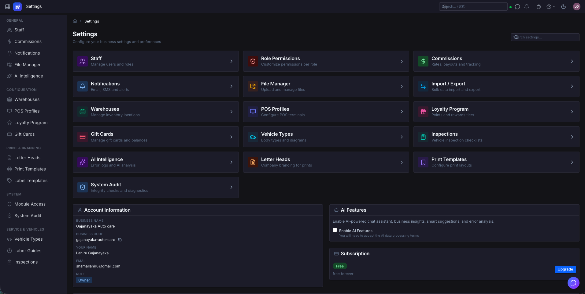

# Retail Smart ERP

A multi-tenant SaaS Point of Sale and ERP system built with **Next.js 16**, **React 19**, and **PostgreSQL**. Supports five business types: Retail, Restaurant, Supermarket, Auto Service, and Dealership.

**Live Demo:** [retailsmarterp.com](https://www.retailsmarterp.com)

## Screenshots

### Landing Page


### Authentication
| Login | Register |
|-------|----------|
|  |  |

### Company Login


### Dashboard


### Point of Sale


### Account Management


### Storage Management


### Settings


## Features

### Core POS
- Real-time Point of Sale with barcode scanning
- Multi-payment method support (cash, card, bank transfer, cheque)
- Receipt printing and thermal printer integration
- Shift management with cash reconciliation
- Layaway and gift card support
- Loyalty program with points tracking

### Multi-Tenant Architecture
- Subdomain-based tenant isolation (`company.retailsmarterp.com`)
- Row Level Security (RLS) at the database level
- Per-tenant settings, currency, and branding
- Role-based access control with 15+ roles
- Per-company storage quota tracking

### Business Type Modules

| Module | Business Types |
|--------|---------------|
| **Inventory & Items** | All |
| **Customers & Suppliers** | All |
| **Sales & Purchases** | All |
| **Accounting** | All (Chart of accounts, journal entries, bank reconciliation, budgets) |
| **HR & Payroll** | All (Employees, salary structures, payroll runs, advances) |
| **Work Orders** | Auto Service |
| **Vehicle Management** | Auto Service, Dealership |
| **Appointments** | Auto Service |
| **Insurance Estimates** | Auto Service |
| **Kitchen Display & Floor Plan** | Restaurant |
| **Table Reservations** | Restaurant |
| **Recipe Management** | Restaurant |
| **Dealership Sales** | Dealership |
| **Test Drives** | Dealership |

### Real-Time Updates
- WebSocket-powered live data sync across all connected clients
- Document presence awareness (see who else is editing)
- Instant POS updates across terminals

### AI Intelligence
- Smart warnings and anomaly detection
- AI-powered error logging and analysis
- Content analysis for file uploads

### Account Management
- Multi-company support from a single account
- Database and file storage usage tracking per company
- Wallet system with billing and payments
- Team management across companies

## Tech Stack

| Layer | Technology |
|-------|-----------|
| **Framework** | Next.js 16 (App Router) |
| **UI** | React 19, Tailwind CSS 4, Lucide Icons |
| **Database** | PostgreSQL with Drizzle ORM |
| **Auth** | NextAuth v5 (JWT strategy) |
| **Real-Time** | Custom WebSocket server |
| **State** | Zustand |
| **File Storage** | Cloudflare R2 |
| **AI** | DeepSeek (primary), Google Gemini (fallback) |
| **Email** | Resend |
| **Deployment** | Railway |

## Getting Started

### Prerequisites
- Node.js 20+
- PostgreSQL 15+
- npm

### Installation

1. **Clone the repository**
   ```bash
   git clone https://github.com/ravindu2012/retail-smart-erp.git
   cd retail-smart-erp
   ```

2. **Install dependencies**
   ```bash
   npm install
   ```

3. **Set up environment variables**
   ```bash
   cp .env.example .env
   ```
   Edit `.env` with your database credentials and API keys.

4. **Set up the database**
   ```bash
   # Run migrations
   npm run db:migrate

   # Create super admin user
   npm run db:seed-admin
   ```

5. **Start the development server**
   ```bash
   npm run dev
   ```
   Open [http://localhost:3000](http://localhost:3000).

### Available Scripts

```bash
npm run dev              # Start dev server with WebSocket support
npm run dev:next         # Start Next.js only (no WebSocket)
npm run build            # Production build
npm run start            # Run production server
npm run lint             # ESLint
npx tsc --noEmit         # TypeScript type checking
npm run db:generate      # Generate migration files from schema changes
npm run db:migrate       # Run pending migrations
npm run db:studio        # Open Drizzle Studio GUI
npx jest                 # Run tests
```

## Project Structure

```
src/
├── app/
│   ├── (auth)/           # Login, register (no auth required)
│   ├── c/[slug]/         # Tenant-scoped pages
│   │   ├── dashboard/    # Dashboard
│   │   ├── pos/          # Point of Sale
│   │   ├── items/        # Inventory management
│   │   ├── customers/    # Customer management
│   │   ├── sales/        # Sales history
│   │   ├── work-orders/  # Auto service work orders
│   │   ├── accounting/   # Chart of accounts, journals, budgets
│   │   ├── hr/           # Employees, payroll
│   │   ├── restaurant/   # Kitchen, tables, orders, recipes
│   │   └── settings/     # Tenant settings
│   ├── account/          # Cross-tenant account management
│   ├── api/              # RESTful API routes
│   └── sys-control/      # System admin panel
├── components/
│   ├── layout/           # Sidebar, Navbar
│   ├── modals/           # 30+ modal components
│   └── ui/               # Reusable UI components
├── hooks/                # Custom React hooks
└── lib/
    ├── auth/             # NextAuth config, roles, permissions
    ├── ai/               # AI integrations
    ├── db/               # Drizzle ORM, schema, RLS helpers
    └── websocket/        # WebSocket server & client
```

## Contributing

We welcome contributions! Here's how to get started:

1. **Fork** this repository
2. **Create** a feature branch (`git checkout -b feature/amazing-feature`)
3. **Commit** your changes (`git commit -m 'Add amazing feature'`)
4. **Push** to the branch (`git push origin feature/amazing-feature`)
5. **Open** a Pull Request

### Guidelines
- Follow the existing code style and patterns
- All API routes must use `validateBody()` for request validation
- Include tenant filtering in all database queries
- Use real-time hooks (`useRealtimeData`) for data-displaying components
- Use server-side pagination (`usePaginatedData`) for list pages
- Test your changes locally before submitting

## License

This project is licensed under the [GNU General Public License v3.0](LICENSE).

## Contact

- **Author:** Ravindu Gajanayaka
- **Website:** [retailsmarterp.com](https://www.retailsmarterp.com)
- **Issues:** [GitHub Issues](https://github.com/ravindu2012/retail-smart-erp/issues)
